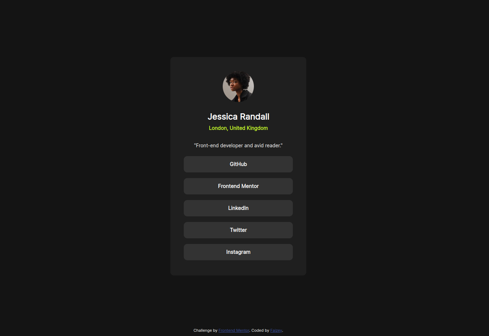

# Frontend Mentor - Social links profile solution

This is a solution to the [Social links profile challenge on Frontend Mentor](https://www.frontendmentor.io/challenges/social-links-profile-UG32l9m6dQ). Frontend Mentor challenges help you improve your coding skills by building realistic projects. 

## Table of contents

- [Overview](#overview)
  - [The challenge](#the-challenge)
  - [Screenshot](#screenshot)
  - [Links](#links)
- [My process](#my-process)
  - [Built with](#built-with)
  - [What I learned](#what-i-learned)
  - [Continued development](#continued-development)
  - [Useful resources](#useful-resources)
- [Author](#author)
- [Acknowledgments](#acknowledgments)

## Overview

### The challenge

Users should be able to:

- See hover and focus states for all interactive elements on the page

### Screenshot

### Links

- Solution URL: [Click Here](https://github.com/faizraeim/social-links-profile)
- Live Site URL: [Click Here](https://faizraeim.github.io/social-links-profile)

## My process

### Built with

- Semantic HTML5 markup
- CSS custom properties
- Mobile-first workflow

### What I learned

Learned how to use media screen and makeing it responsive for mobile view of 375px. 

### Useful resources

- [w3schools](https://www.w3schools.com) - Helped me align items in center.
- [ChatGPT](https://www.chatgpt.com) - Helped me correctly do a mobile screen responsive desing and solve my code errors.

# Author

- Website - [faizey.co](https://www.faizey.co)
- Frontend Mentor - [@faizraeim](https://www.frontendmentor.io/profile/faizraeim)
- LinkedIn - [@faizey](https://www.linkedin.com/in/faizey)
- Twitter - [@faizraeim](https://www.twitter.com/faizraeim)
